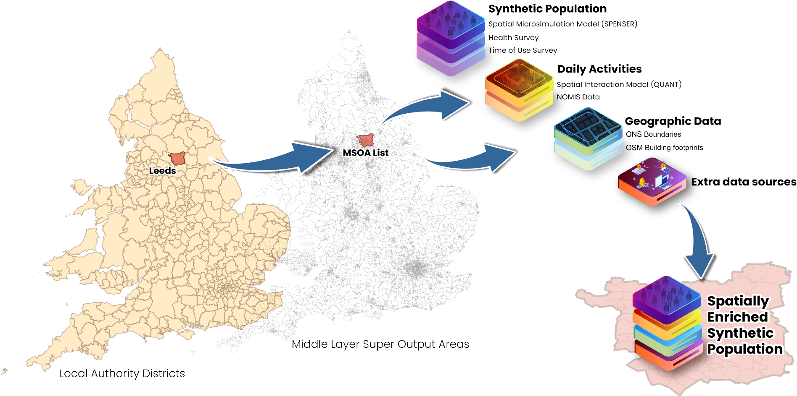

# Synthetic Population Catalyst

The Synthetic Population Catalyst (SPC) makes it easier for researchers to work
with synthetic population data in England. It combines a variety of [data
sources](https://alan-turing-institute.github.io/uatk-spc/data_sources.html)
and outputs a single file in [protocol buffer
format](https://github.com/alan-turing-institute/uatk-spc/blob/main/synthpop.proto),
describing the population in a given study area. The tool also provides methods
to export the outcome in diferent formats often use for researchers like CSV or
JSON.

The input of the SPC tool is a list of the Middle Layer Super Output Area
(MSOAs) where you want to create a spatially enriched sythetic population to
feed other dynamic models. SPC includes a script to assist you with the proper
list of the MSOAs by defining a Local Authority District area in England. [Get
started](https://alan-turing-institute.github.io/uatk-spc/)
to download SPC data or run the tool in different MSOAs.

## Lineage

The history of this project is as follows:

1. The Dynamic Model for Epidemics (DyME), originally written in R, then later converted to Python and OpenCL was first written:
   [https://github.com/Urban-Analytics/RAMP-UA](https://github.com/Urban-Analytics/RAMP-UA)
2. The "ecosystem of digital twins" branch heavily refactored the code to
   support running in different study areas and added a new seeding and commuting modelling:
   [https://github.com/Urban-Analytics/RAMP-UA/tree/Ecotwins-withCommuting](https://github.com/Urban-Analytics/RAMP-UA/tree/Ecotwins-withCommuting)
3. This separate repository was created to port the initialisation logic to
   Rust, following the above branch.

There are many contributors to the project through these different stages; the
version control history can be seen on Github in the other repositories.

## Docker

Build an image to play with the codebase locally by running:

`docker build -t spc_demo .`

from the base directory of this repository.
